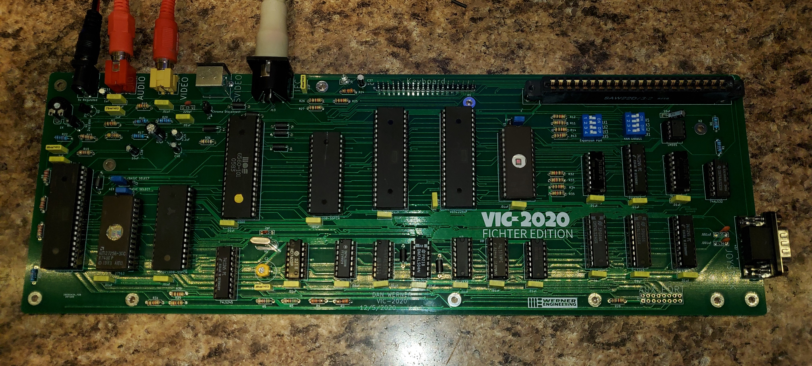

# Vic-2020
A Vic-20 clone created with [almost] all readily available parts

## Introduction
This project is an open source implementation of a VIC-20 (mostly) compatible computer. The project is built using a combination of 1980's era components (7400-series logic) and more modern components- such as a modern 6502 variant and 512 KiB SRAM and 512 KiB Flash ROMs. The only hard to find component is the MOS 6560 VIC video chip -- and it is my hope to follow up this project with a project to replace that chip with a FPGA replacement, providing the open source community a full path to re-creating the VIC-20 with all new components. 

## Why?
Why would I do a replica of the VIC-20?   Well, like many others the VIC-20 was my first computer.  In 1981 I spent most of my (non-school) waking hours learning everything possible about this machine, and that launched me into a successful career in IT.   In the early 2000s I discovered the retro-computer scene and have spent many hours building and creating new retro computer designs following the work happening in such places as 6502.org and retrobrewcomputers.org.  So much so, that my boss (Jamie Fichter) has taken to giving me crap about spending my free time "Building VIC-20s" . . . .   It was earlier in 2020 when he had made one such comment that I realized that while I had constructed many vintage designs, I had never actually built a VIC-20.  I decided that I should correct that oversight as soon as possible -- and thus the VIC-2020 Fichter Edition was born.  

## What is included in this repo?
As of this time, the repo includes
*The VIC-2020 Mainboard PCB Kicad design and Gerber files
*The VIC-2020 Keyboard PCB Kicad design and Gerber files
*OpenSCAD and STL files for a 3d printed case
*Design Files for Max Keyboard Custom Printed Keycaps

---

## Edit a file

You’ll start by editing this README file to learn how to edit a file in Bitbucket.

1. Click **Source** on the left side.
2. Click the README.md link from the list of files.
3. Click the **Edit** button.
4. Delete the following text: *Delete this line to make a change to the README from Bitbucket.*
5. After making your change, click **Commit** and then **Commit** again in the dialog. The commit page will open and you’ll see the change you just made.
6. Go back to the **Source** page.

---

## Create a file

Next, you’ll add a new file to this repository.

1. Click the **New file** button at the top of the **Source** page.
2. Give the file a filename of **contributors.txt**.
3. Enter your name in the empty file space.
4. Click **Commit** and then **Commit** again in the dialog.
5. Go back to the **Source** page.

Before you move on, go ahead and explore the repository. You've already seen the **Source** page, but check out the **Commits**, **Branches**, and **Settings** pages.

---

## Clone a repository

Use these steps to clone from SourceTree, our client for using the repository command-line free. Cloning allows you to work on your files locally. If you don't yet have SourceTree, [download and install first](https://www.sourcetreeapp.com/). If you prefer to clone from the command line, see [Clone a repository](https://confluence.atlassian.com/x/4whODQ).

1. You’ll see the clone button under the **Source** heading. Click that button.
2. Now click **Check out in SourceTree**. You may need to create a SourceTree account or log in.
3. When you see the **Clone New** dialog in SourceTree, update the destination path and name if you’d like to and then click **Clone**.
4. Open the directory you just created to see your repository’s files.

Now that you're more familiar with your Bitbucket repository, go ahead and add a new file locally. You can [push your change back to Bitbucket with SourceTree](https://confluence.atlassian.com/x/iqyBMg), or you can [add, commit,](https://confluence.atlassian.com/x/8QhODQ) and [push from the command line](https://confluence.atlassian.com/x/NQ0zDQ).