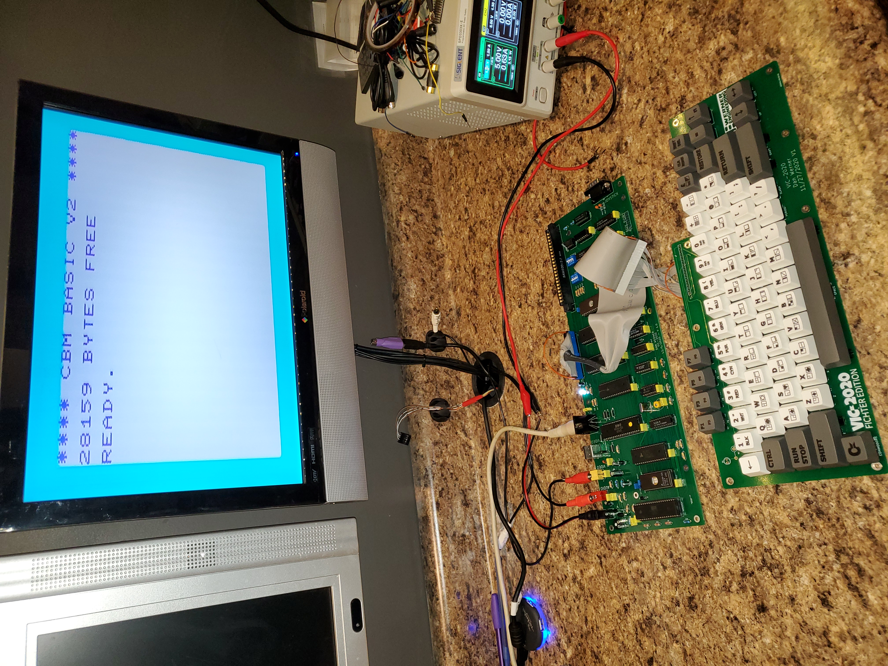
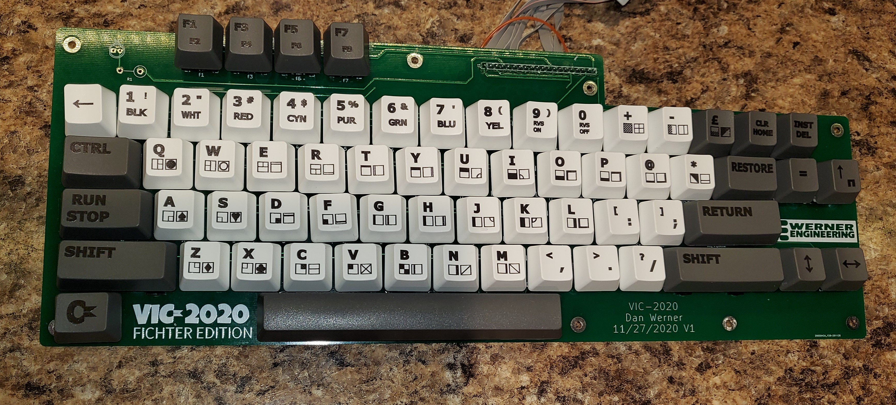

# Vic-2020
A Vic-20 clone created with [almost] all readily available parts

## Introduction
This project is an open source implementation of a VIC-20 (mostly) compatible computer. The project is built using a combination of 1980's era components (7400-series logic) and more modern components- such as a modern 6502 variant and 512 KiB SRAM and 512 KiB Flash ROMs. The only hard to find component is the MOS 6560 VIC video chip -- and it is my hope to follow up this project with a project to replace that chip with a FPGA replacement, providing the open source community a full path to re-creating the VIC-20 with all new components. 

## Why?
Why would I do a replica of the VIC-20?   Well, like many others the VIC-20 was my first computer.  In 1981 I spent most of my (non-school) waking hours learning everything possible about this machine, and that launched me into a successful career in IT.   In the early 2000s I discovered the retro-computer scene and have spent many hours building and creating new retro computer designs following the work happening in such places as 6502.org and retrobrewcomputers.org.  So much so, that my boss (Jamie Fichter) has taken to giving me crap about spending my free time "Building VIC-20s" . . . .   It was earlier in 2020 when he had made one such comment that I realized that while I had constructed many vintage designs, I had never actually built a VIC-20.  I decided that I should correct that oversight as soon as possible -- and thus the VIC-2020 Fichter Edition was born.  

## What is included in this repo?
As of this time, the repo includes

1. The VIC-2020 Mainboard PCB Kicad design and Gerber files
2. The VIC-2020 Keyboard PCB Kicad design and Gerber files
3. OpenSCAD and STL files for a 3d printed case
4. Design Files for Max Keyboard Custom Printed Keycaps

## Known Bugs

* While the mainboard does have a S-VIDEO mod applied that should (in theory) provide S-VIDEO output, it does not work.   If anyone corrects this, please feel free to reach out and I will correct the schematics -- but for now, I would not populate the S-VIDEO connector, and always short the Chroma Disconnect jumper.

## How is the VIC-2020 the same as a VIC-20?

The VIC-2020 should be mostly software compatible with the expanded and unexpanded Commodore VIC-20.   I have tested a variety of cartridges (commodore and third party) and have ran several homebrew and commercial disk based programs on the system with no issues.   Note that this does use a more modern variant of the 6502, so software relying on 6502 undocumented opcodes or bugs will not work properly.  The VIC-2020 has a commodore compatible IEC port that has been tested with a real 1571 and real 1541 and seems to work properly with one exception -- if the device holds the RESET line low the system will not function.   This can be observed if the VIC-2020 is connected to a powered off IED device -- the VIC will not function until the IEC device is powered on or unplugged from the VIC.

## How is the VIC-2020 different from a VIC-20?

Because the VIC-2020 is using more modern parts, it has ALOT of ram compared to the VIC-20.   The original VIC-20 shipped with 4k of ram . . .  the VIC-2020 has 256k.  This has some implications.   First, for compatibility there is a portion of the RAM that is just wasted. Of the 128k chip that is used for main memory, only 32k is accessible, the rest is hidden.  This is a design trade off that made the system less complex and ensured compatibility.   That said, small design changes were made to allow the 128k color ram to be totally usable by the system.  The first modification allowed all 8 bits of color ram to be used as storage for the system.  In the original VIC-20, color ram was only 4 bits wide, as the VIC chip only needs 4 bits to store color information.  In the VIC-2020 design all 8 bits are available to the CPU, even though only 4 bits are used by the VIC chip.  This should allow a programmer to store user information in the upper 4 bits of the color ram without affecting any other part of the system.   Also, the 6522 IO port that was dedicated to the user port on the VIC-20 has been repurposed as a "Page Register" (located at 0x9110 or 37136) on the VIC-2020 allowing 128 pages of color ram to be available for the VIC chip.  This should give the ability for some very interesting color effects to be produced on the VIC-2020, while still keeping the VIC mostly compatible.

For simplicity sake, the VIC-2020 in even its lowest memory configuration has the VIC 3K memory expansion enabled at RAM1, RAM2, and RAM3, giving it's base ram to be 6k.   This configuration is totally compatible with most "unexpanded" vic software, but us incompatible with any cartridge that includes the 3k RAM expansion option (such as the VIC Super Expander Cartridge).  The other RAM configuration options for BLK1, BLK2, BLK3, and BLK5 are DIP switch selectable allowing memory to be configured.

* While the mainboard does have a S-VIDEO mod applied that should (in theory) provide S-VIDEO output, it does not work.   If anyone corrects this, please feel free to reach out and I will correct the schematics -- but for now, I would not populate the S-VIDEO connector.

As of this time, the repo includes

## Edit a file

You’ll start by editing this README file to learn how to edit a file in Bitbucket.

1. Click **Source** on the left side.
2. Click the README.md link from the list of files.
3. Click the **Edit** button.
4. Delete the following text: *Delete this line to make a change to the README from Bitbucket.*
5. After making your change, click **Commit** and then **Commit** again in the dialog. The commit page will open and you’ll see the change you just made.
6. Go back to the **Source** page.

---

## Create a file

Next, you’ll add a new file to this repository.

1. Click the **New file** button at the top of the **Source** page.
2. Give the file a filename of **contributors.txt**.
3. Enter your name in the empty file space.
4. Click **Commit** and then **Commit** again in the dialog.
5. Go back to the **Source** page.

Before you move on, go ahead and explore the repository. You've already seen the **Source** page, but check out the **Commits**, **Branches**, and **Settings** pages.

---

## Clone a repository

Use these steps to clone from SourceTree, our client for using the repository command-line free. Cloning allows you to work on your files locally. If you don't yet have SourceTree, [download and install first](https://www.sourcetreeapp.com/). If you prefer to clone from the command line, see [Clone a repository](https://confluence.atlassian.com/x/4whODQ).

1. You’ll see the clone button under the **Source** heading. Click that button.
2. Now click **Check out in SourceTree**. You may need to create a SourceTree account or log in.
3. When you see the **Clone New** dialog in SourceTree, update the destination path and name if you’d like to and then click **Clone**.
4. Open the directory you just created to see your repository’s files.

Now that you're more familiar with your Bitbucket repository, go ahead and add a new file locally. You can [push your change back to Bitbucket with SourceTree](https://confluence.atlassian.com/x/iqyBMg), or you can [add, commit,](https://confluence.atlassian.com/x/8QhODQ) and [push from the command line](https://confluence.atlassian.com/x/NQ0zDQ).